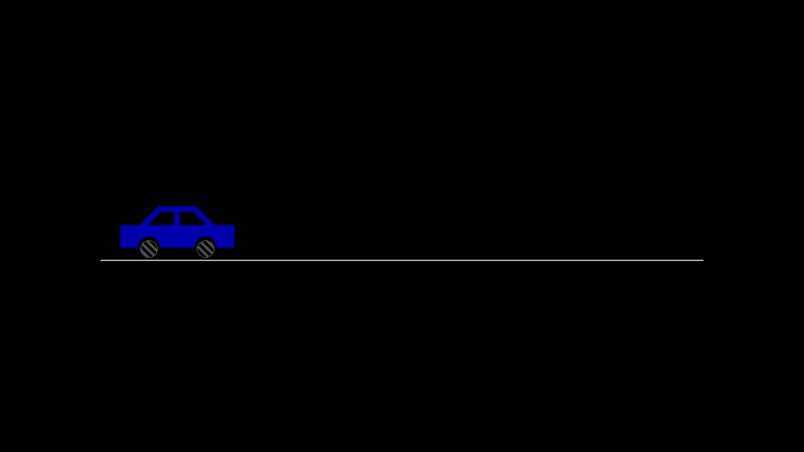
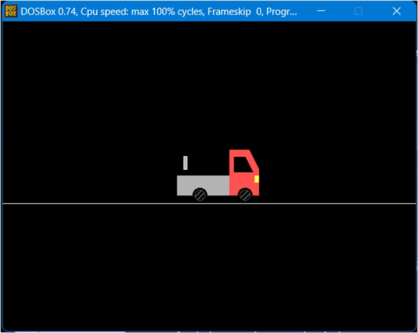

````markdown
# Vehicle Animations in C

This repository contains C programs that demonstrate moving vehicle animations using the `graphics.h` library. The animations include:

1. A car moving across the screen on a road.
2. A truck moving along a road with detailed graphical elements like exhaust pipes, headlights, and tires.

---

## 📑 Index

1. [Features](#-features)
2. [Requirements](#-requirements)
3. [How to Run the Programs](#️-how-to-run-the-programs)
4. [Output Previews](#️-output-previews)
   - [Car Animation](#car-animation)
   - [Truck Animation](#truck-animation)
5. [License](#-license)
6. [Contributing](#-contributing)
7. [Acknowledgments](#-acknowledgments)

---

## 🚗 Features

- **Car Animation**: A simple car moves across the screen, showcasing dynamic movement and graphical rendering.
- **Truck Animation**: A detailed truck moves across the road, featuring realistic components like exhaust pipes, headlights, and a cabin.

---

## 💻 Requirements

- Turbo C++ or an equivalent compiler that supports `graphics.h`.
- Ensure the graphics driver path is correctly set (e.g., `C:/TURBOC3/BGI`).

---

## 🛠️ How to Run the Programs

1. Download and install Turbo C++ or another compiler that supports `graphics.h`.
2. Clone this repository:
   ```bash
   git clone https://github.com/<your-username>/Vehicle-Animations-C.git
   cd Vehicle-Animations-C
   ```
````

3. Open the `.c` file for the animation you want to run in your compiler:
   - `car_animation.c` for the car animation.
   - `truck_animation.c` for the truck animation.
4. Ensure the graphics driver path is correctly configured:
   ```c
   initgraph(&gd, &gm, "C:/TURBOC3/BGI");
   ```
5. Compile and run the program.

---

## 🖼️ Output Previews

### Car Animation



### Truck Animation



---

## 📜 License

This repository is licensed under the [MIT License](LICENSE).

---

## 🌟 Contributing

Contributions, issues, and feature requests are welcome! Feel free to check the [issues page](https://github.com/TheHarmanCodes/Vehicle-Animations-C/issues).

---

## ✨ Acknowledgments

- Built with Turbo C++.
- Inspired by beginner-friendly computer graphics projects.
- Special thanks to the `graphics.h` library for enabling graphical development in C.

---
